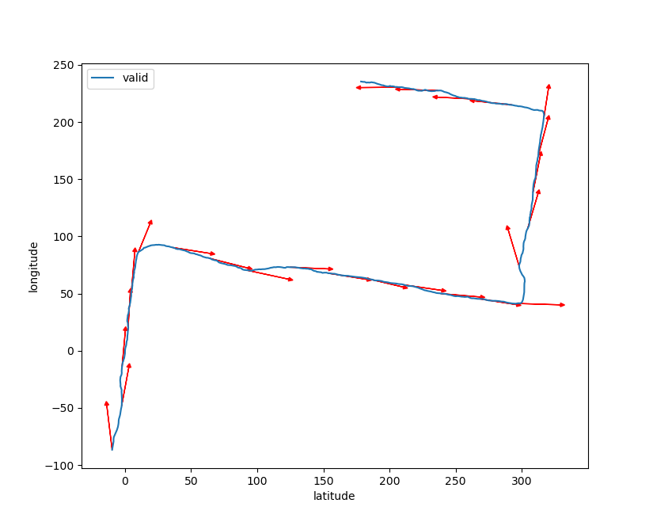

<h1 style="margin-top: 4em">
高级机器学习作业
</h1>

# <h1 class="center title">PDR: 室内行人移动方位推算技术</h1>

<h3>院系：人工智能学院</h3>
<h3>组长：方盛俊 (201300035)</h3>
<h3>组员：任圣杰 (201300036) &nbsp;&nbsp;&nbsp;&nbsp;&nbsp;&nbsp;&nbsp;&nbsp;&nbsp;&nbsp;&nbsp;曹明隽 (201300031)</h3>
<h3>邮箱：201300035@smail.nju.edu.cn</h3>
<h3>时间：2022 年 11 月 30 日</h3>

<!-- 生成目录 -->

## <h1>目录</h1>

[TOC]

<!-- 文章主体内容 -->

## 一、问题描述

由于室内 GPS 信号受到阻隔，同时车库场景无线接入点 AP 较为稀疏，导致室内定位很难通过 GPS 或位置指纹等技术实现，但行人行位推算技术（Pedestrian Dead Reckoning，PDR）可以有效解决这一问题，即在 GPS 阻隔条件下，利用手机内置传感器（包括不限于加速计、陀螺仪、磁强计），设计轻量级低功耗算法运行框架和技术，实现稳定可靠、高精度的方位推算计算。

**截止时间：12 月 3 日晚上 23: 59（星期六晚上）**

利用手机内置的传感器收集信息，推算设备的位置信息。（曹明隽）

**文档要求：**

- **统一使用中文标点符号；**
- **中文和英文之间要隔一个空格；**
- **每一个段落空一行。**
- **图片统一保存在 `./images` 文件夹下**

## 二、数据收集

### 2.1 二级标题

数据的基本信息，即收集了多少数据，收集了什么状态下的数据。（曹明隽）

**数据特点：**

在实验过程中，手机大部分时间保持在同一个状态下，如一直拿在手上。

收集的数据应该包括不同状态下采集到的数据，包括但不限于拿在手上，放在背包里，放在裤兜里等。

### 2.2 二级标题

### 2.2.1 三级标题

在实验中如何对数据进行划分。（曹明隽）

## 三、总体思路

### 3.1 二级标题

### 3.1.1 三级标题

总体思路为步伐检测和方向预测。（任圣杰、方盛俊)

模型使用的算法没有限制，可以自行选择自己认为合理的算法。比如，可以直接把这个任务看成一个线性或者非线性的回归问题，也可以将此任务看成一个时间序列预测的问题，或者训练模型分别预测移动方向和移动速度，从而计算出当前位置，亦或利用强化学习解决这个问题等。但需要在实验报告中体现出该方法的合理性。

## 四、数据预处理

（方盛俊）

## 五、步伐检测

尝试使用了哪些方法，为什么使用这些方法，方法的效果怎么样，如果效果不好，可能的原因时什么，如何解决这些问题。以及在迁移场景的完成情况。（任圣杰）

## 六、方向预测

尝试使用了哪些方法，为什么使用这些方法，方法的效果怎么样，如果效果不好，可能的原因时什么，如何解决这些问题。以及迁移场景的完成情况。（方盛俊）

## 七、统一算法

如何合并以上的代码（任圣杰、方盛俊）

## 八、运行代码

如何运行代码。（曹明隽）

## 九、性能测试

在完成代码后测试，然后完成报告。（曹明隽）

### 9.1 在 test_case0 上的运行情况

包括模型推理准确性以及推理速度等。

### 9.2 在测试数据集上的运行情况

包括模型推理准确性以及推理速度等。

### 9.3 在收集数据集上的运行情况

包括模型推理准确性以及推理速度等。

### 9.4 迁移场景的完成情况

可能会和上一小节合并。

## 十、小组分工

分工情况。（方盛俊）

## 十一、参考文献

参考文献。（曹明隽、任圣杰、方盛俊）

